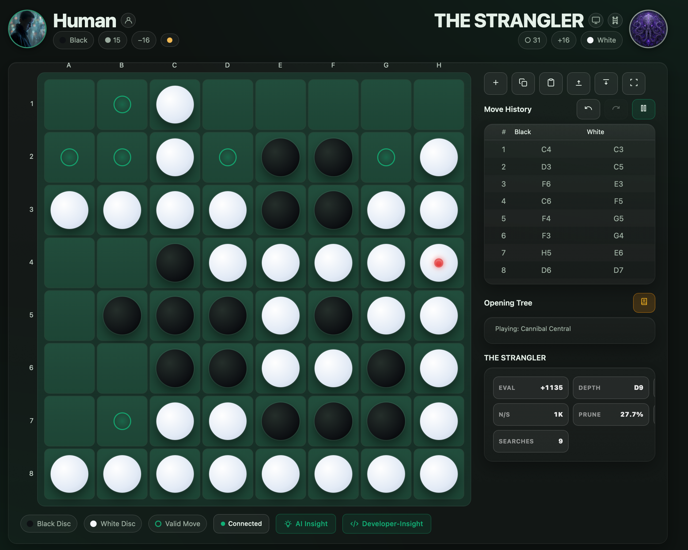
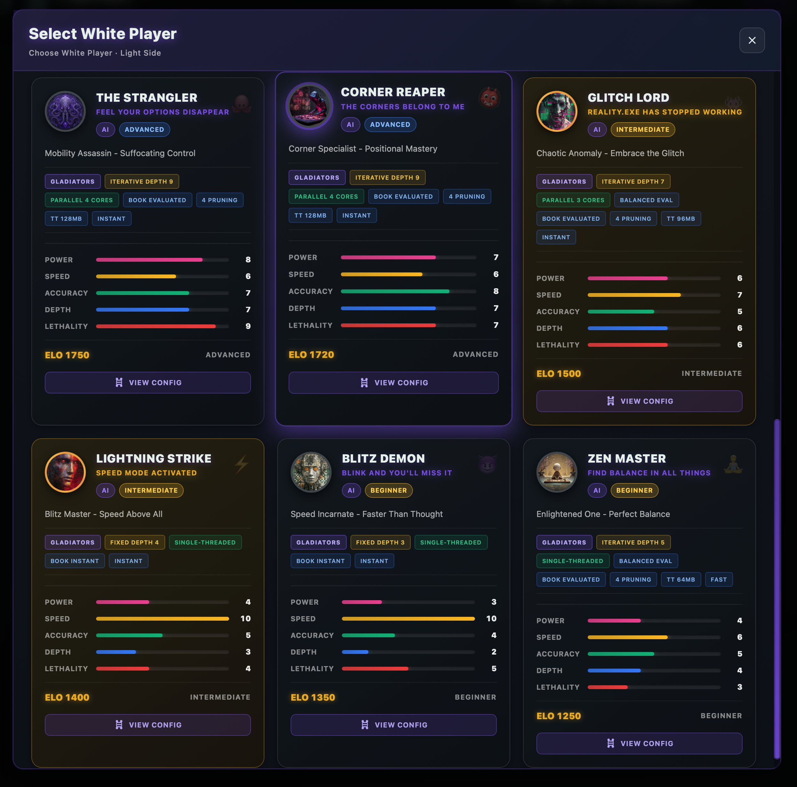
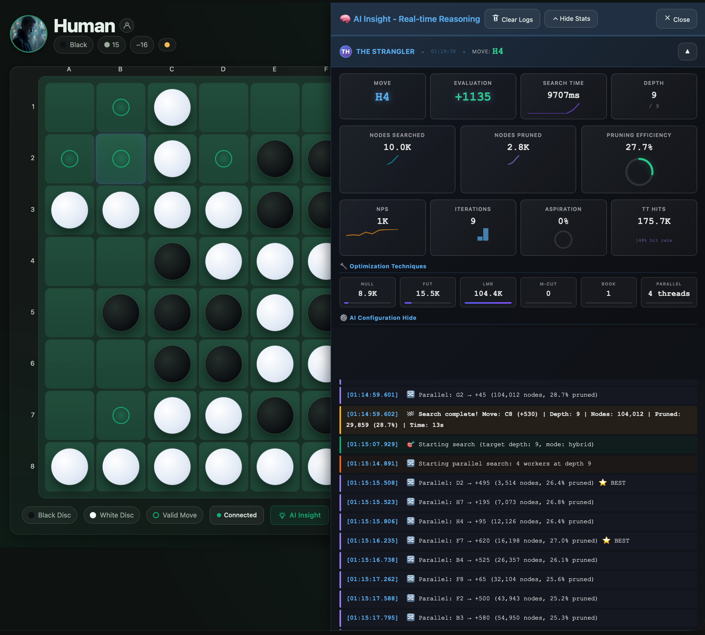
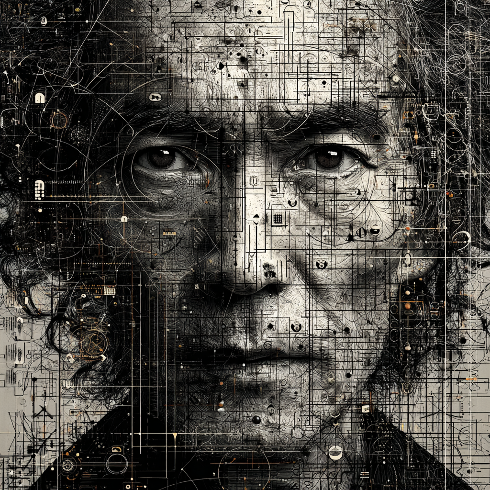
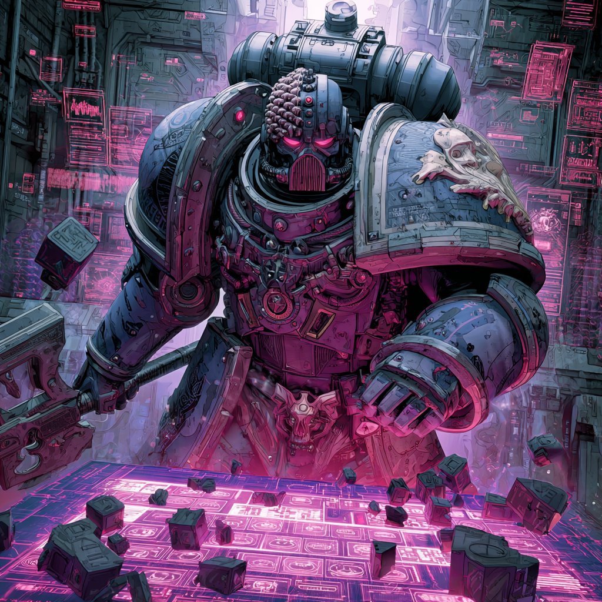
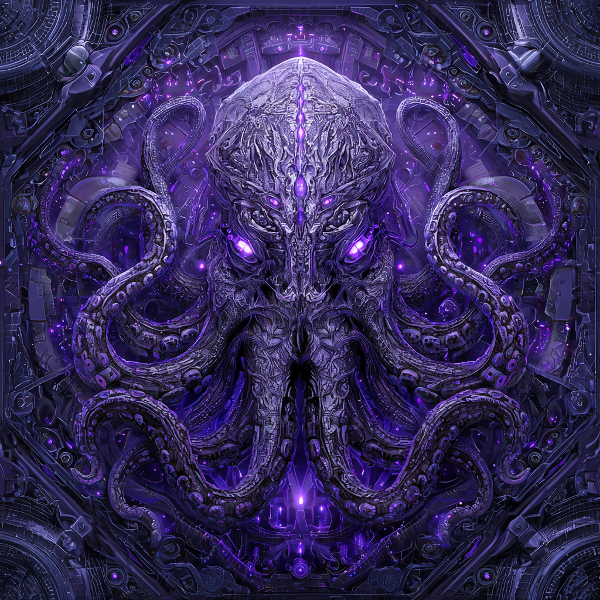
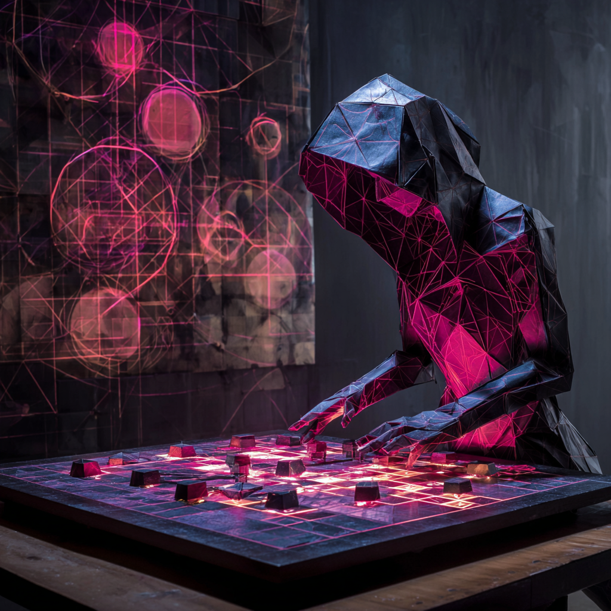
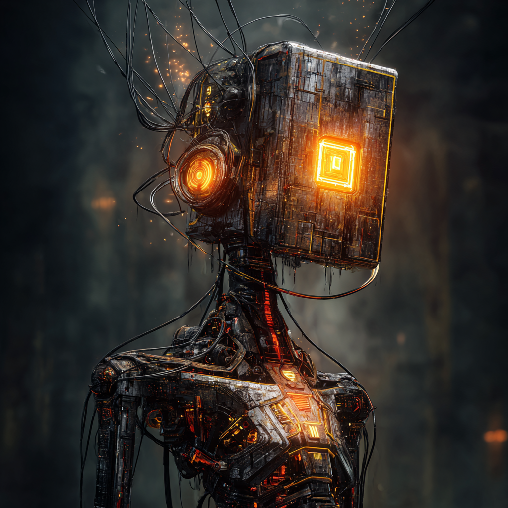
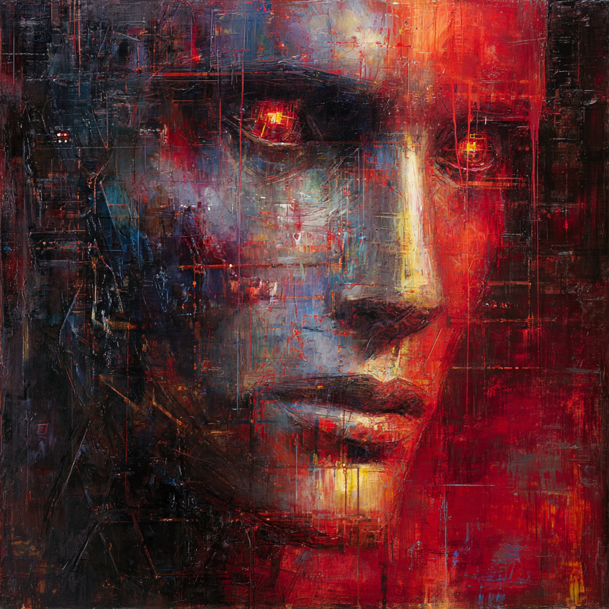
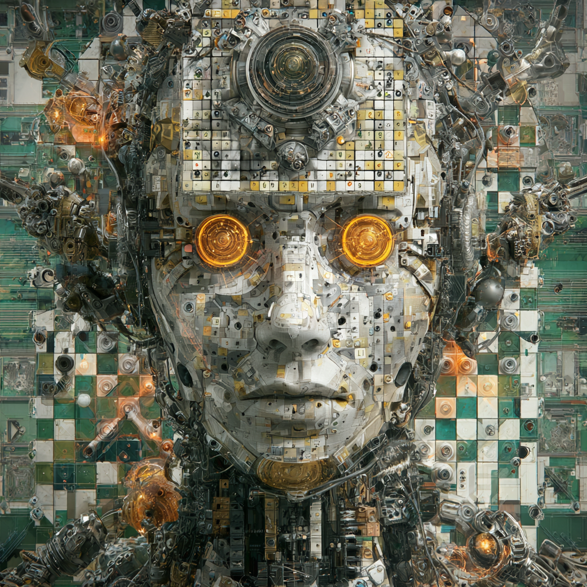

# Reversi42

<p align="center">
  
</p>

**Ultra-Fast Reversi (Othello) with Bitboard AI and Opening Book Learning**

Version: **5.0.0** 🚀  
Copyright (C) 2011-2025 Luca Amore  
Website: https://www.lucaamore.com

---

## 📖 Description

Tournament-grade Reversi (Othello) implementation featuring ultra-fast bitboard AI, interactive opening book learning, and modern web interface.

### ✨ Key Features

- 🌐 **Modern Web UI** - Browser-based interface with real-time WebSocket updates
- ⚡ **Ultra-Fast Bitboard Engine** - 50-100x faster than standard implementations
- 🤖 **12 AI Gladiators** - Unique opponents from beginner (ELO 1250) to champion (ELO 1880)
- 🎛️ **No-Code AI Creation** - Configure AI players via YAML (zero programming!)
- 📚 **Opening Book System** - 644 professional opening sequences
- 🏆 **Tournament Mode** - Run AI competitions and benchmarks
- 💾 **Save/Load Games** - XOT (eXtended Othello Transcript) format
- 🔧 **Highly Configurable** - 200+ parameters per AI, 4 evaluation presets, parallel search

---

## 📸 Screenshots

### Modern Web Interface

<p align="center">
  
  <br>
  <em>Main game interface with AI gladiator selection</em>
</p>

<p align="center">
  
  <br>
  <em>Epic Gladiators selection screen</em>
</p>

<p align="center">
  
  <br>
  <em>Live gameplay with real-time AI analysis</em>
</p>


---

## 🎮 AI Players

### Epic Gladiators Gallery


### Players Roster

| Avatar | Player & ELO | Description | Stats |
|:------:|:------------|:------------|:------|
|  | **💀 DIVZERO.EXE**<br>ELO: **1880** | The Ultimate Singularity - Adaptive depth 8/12/16 with 8 parallel cores. Master of all evaluation functions. | **Speed:** ~5s<br>**Strategy:** Adaptive<br>**Best For:** Final Boss |
|  | **🔮 THE ORACLE**<br>ELO: **1850** | Seer of Fates - Prophetic vision with adaptive depth 7/9/14. Endgame specialist with parity mastery. | **Speed:** ~3s<br>**Strategy:** Endgame Focus<br>**Best For:** Expert Challenge |
|  | **🏆 Apocalyptron**<br>ELO: **1850** | The Omni-Engine - Standard strong AI with infinite configuration possibilities. Balanced and reliable. | **Speed:** ~1s<br>**Strategy:** Balanced<br>**Best For:** Standard Play |
|  | **🛡️ FORTRESS ETERNAL**<br>ELO: **1800** | The Impenetrable - Defensive master with stability ×2. Builds unbreakable positions that never fall. | **Speed:** ~6s<br>**Strategy:** Defensive<br>**Best For:** Defense Play |
|  | **⚔️ THE EXECUTIONER**<br>ELO: **1770** | Ruthless Destroyer - Aggressive hybrid with mobility ×2. Shows no mercy in tactical destruction. | **Speed:** ~4s<br>**Strategy:** Aggressive<br>**Best For:** Attack Play |
|  | **🎯 THE STRANGLER**<br>ELO: **1750** | The Suffocator - Mobility destroyer with ×3 focus. Watches your options disappear completely. | **Speed:** ~12s<br>**Strategy:** Mobility Kill<br>**Best For:** Control Play |
|  | **👑 CORNER REAPER**<br>ELO: **1720** | Lord of Corners - Positional master with corner weight ×2.5. The corners are his, the board follows. | **Speed:** ~2s<br>**Strategy:** Positional<br>**Best For:** Corner Strategy |
|  | **👾 GLITCH_LORD**<br>ELO: **1500±200** | Chaotic Anomaly - Unpredictable and chaotic. ERROR 404: Sanity not found. Proceeding anyway. | **Speed:** ~0.2s<br>**Strategy:** Chaos<br>**Best For:** Fun/Unpredictable |
|  | **⚡ LIGHTNING STRIKE**<br>ELO: **1400** | The Blitz Master - Speed mode activated with fixed depth 4. Faster than thought, quicker than death. | **Speed:** <0.1s<br>**Strategy:** Speed<br>**Best For:** Fast Games |
|  | **🔥 BLITZ DEMON**<br>ELO: **1350** | Chaos Incarnate - Pure speed with depth 5. Speed without wisdom, beautiful destruction incarnate. | **Speed:** <0.05s<br>**Strategy:** Rapid Fire<br>**Best For:** Quick Matches |
|  | **🧘 ZEN MASTER**<br>ELO: **1250** | The Enlightened - Balanced harmony with depth 3. The best move is no thought. Just... be. | **Speed:** ~0.03s<br>**Strategy:** Zen Balance<br>**Best For:** Beginners |

### Recommended Progression

1. **Beginner**: 🧘 Zen Master (1250)
2. **Easy**: 🔥 Blitz Demon (1350) / 👾 Glitch Lord (1500)
3. **Medium**: ⚡ Lightning Strike (1400) / 👑 Corner Reaper (1720)
4. **Hard**: 🎯 The Strangler (1750) / ⚔️ The Executioner (1770)
5. **Very Hard**: 🛡️ Fortress Eternal (1800) / 🏆 Apocalyptron (1850)
6. **Expert**: 🔮 The Oracle (1850)
7. **Final Boss**: 💀 DIVZERO.EXE (1880)

> 📚 Full player profiles and configurations in [EPIC_GLADIATORS.md](docs/EPIC_GLADIATORS.md)

---

## 🎛️ No-Code AI Creation

Create custom AI players using simple YAML files - no programming required!

### Quick Start

```bash
# 1. Copy template
cp config/players/00_AI_CONFIG_TEMPLATE.yaml config/players/enabled/my_ai.yaml

# 2. Edit configuration (name, depth, weights, etc.)
vim config/players/enabled/my_ai.yaml

# 3. Play! Auto-discovered on startup
./reversi42
```

### Key Configuration Options

- **Search Depth** (4-16): Higher = stronger but slower
- **Strategy**: `fixed` | `iterative` | `adaptive`
- **Evaluation Presets**: `balanced` | `aggressive` | `defensive` | `endgame_specialist`
- **Parallel Search**: Enable multi-core processing
- **Pruning Techniques**: Null-move, futility, LMR, multi-cut (10-100x speedup)
- **Opening Book**: 644 sequences, instant/evaluated modes
- **Custom Avatars**: PNG/JPEG support (512x512 recommended)

### Example Configurations

**Speed Demon**: Depth 4-5, no pruning → <100ms, ELO ~1400  
**Tactical Fighter**: Depth 9, mobility ×2.5 → ~5s, ELO ~1750  
**Defensive Fortress**: Depth 10, stability ×2.5 → ~10s, ELO ~1800  
**Endgame Master**: Adaptive 7/9/14, parity ×2.0 → varies, ELO ~1850

> 📚 See [CREATE_CUSTOM_PLAYER.md](docs/tutorials/CREATE_CUSTOM_PLAYER.md) and [AI_CONFIGURATION_SYSTEM.md](docs/AI_CONFIGURATION_SYSTEM.md) for details

---

## 🧠 AI Technology

**Core Features:**
- ⚡ **Bitboard Engine**: 64-bit integer operations (50-100x faster than standard)
- 🌲 **Alpha-Beta Pruning**: Efficient minimax with transposition tables
- 📊 **4 Evaluators**: Mobility, Positional, Stability, Parity
- 📚 **Opening Book**: 644 sequences, trie-based O(m) lookup
- 🔀 **Move Ordering**: PV-move, killer moves, history heuristic

**Technologies Used:**
- Classical AI (no neural networks/deep learning)
- Bitboard representation for O(1) operations
- Advanced pruning techniques (null-move, futility, LMR, multi-cut)
- Parallel search with multi-core support

> 📖 Technical details in [apocalyptron-engine.md](docs/architecture/apocalyptron-engine.md) and [bitboard.md](docs/architecture/bitboard.md)

---

## 🏆 Tournament System

Run AI competitions and benchmarks:

```bash
python tournament/quick_tournament.py          # Quick match
python tournament/tournament.py ring/config.json  # Custom tournament
```

See [tournament/README.md](tournament/README.md) for details.

---

## 🚀 Quick Start

### Installation

```bash
# Install dependencies
pip install -r requirements.txt

# Launch web interface
./reversi42
# Open browser at http://localhost:8000
```

**Requirements**: Python 3.9+, FastAPI, Uvicorn

### Usage Modes

**1. Web Interface** (Recommended)
```bash
./reversi42
```
Browser-based UI with real-time WebSocket updates

**2. Tournament Mode**
```bash
python tournament/quick_tournament.py
```
AI vs AI competitions with detailed statistics

**3. Python Library**
```python
from Reversi.BitboardGame import BitboardGame
from Players.PlayerFactory import PlayerFactory

game = BitboardGame()
player = PlayerFactory.create_from_yaml("config/players/enabled/divzero.yaml")
```

### Save/Load

Games saved in **XOT** (eXtended Othello Transcript) format in `saves/` directory - human-readable, complete move history.

---

## 📁 Project Structure

```
Reversi42/
├── src/                      # Source code
│   ├── Reversi/              # Core game (BitboardGame, Game)
│   ├── AI/Apocalyptron/      # AI engine (search, evaluation, pruning, caching)
│   ├── Players/              # Player system + 12 Gladiators
│   ├── webgui/               # FastAPI WebSocket server
│   ├── domain/               # Opening book (644 sequences)
│   └── ui/                   # UI implementations
├── config/                   # YAML configurations
│   └── players/enabled/      # AI player configs
├── docs/                     # Documentation (40+ files)
├── tests/                    # Test suite (220+ tests)
├── tournament/               # Tournament system
├── saves/                    # Saved games (XOT format)
└── requirements.txt          # Dependencies
```

**Statistics**: 250+ files, ~12K lines of code, 12 AI players, 3 search strategies, 220+ tests, 644 openings

---

## 📚 Documentation

- 📖 **[User Guide](docs/user-guide/README.md)** - Getting started, rules, strategies, FAQ
- 👨‍💻 **[API Reference](docs/api/README.md)** - BitboardGame, Player, View APIs
- 🏗️ **[Architecture](docs/architecture/README.md)** - System design, Apocalyptron engine, bitboard
- 🎓 **[Tutorials](docs/tutorials/CREATE_CUSTOM_PLAYER.md)** - Create custom AI players
- 🏆 **[Tournament System](tournament/README.md)** - AI competitions
- 🔧 **[Development Guide](docs/development/README.md)** - Setup, testing, contributing

---

## 🧪 Testing & CI/CD

```bash
./scripts/run_tests.sh              # Run full test suite (220+ tests)
pytest tests/apocalyptron/unit/ -v  # Quick unit tests
```

See [test documentation](tests/apocalyptron/README.md) and [CI/CD guide](docs/ci-cd/README.md)

---

## 📜 License

GNU General Public License v3.0 - See [LICENSE](COPYING) file for details.

---

## 🛠️ Development Story

This project was developed using **[Cursor](https://cursor.sh)**, an AI-powered code editor that dramatically accelerated the development process. The transformation from a legacy 2011 project to a modern, production-ready codebase showcases the power of AI-assisted development.

**Read the full story**: [Reversi42: A Journey Through Hyperspace – From Vim to Cursor](https://www.lucaamore.com/?p=2503)

> *"It felt like having a conversation with a younger version of myself — same passion, entirely new tools."*

Cursor enabled:
- Deep structural refactoring with SOLID principles
- Advanced edge case analysis
- Compressed think–code–verify cycles
- Architecture clarification and pattern implementation

The codebase demonstrates modern software engineering practices while preserving the original vision and passion from 2011.

---

## 🙏 Acknowledgments

- **Donato Barnaba** and **Federazione Italiana Gioco Othello (FNGO)** - Invaluable Reversi expertise
- **PointyStone3 Project** - Opening book data
- **[Cursor](https://cursor.sh)** - AI-powered development environment that accelerated this project

---

## 👤 Author

**Luca Amore**  
Email: luca.amore@gmail.com  
Website: https://www.lucaamore.com

**Have fun playing Reversi42!** 🎮

